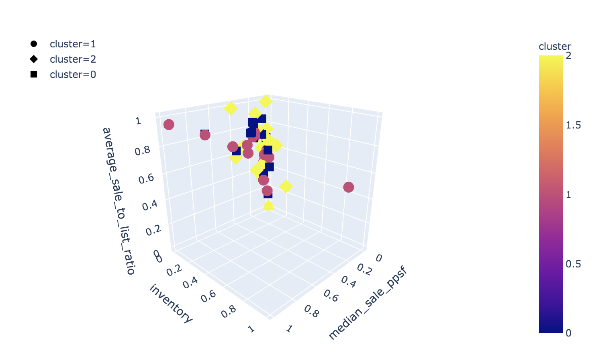

# Project-3 Exodus REIT
### Group Members
- Aljjohara Aloudan
- Mindy Bright
- Daniel Brims
- Anton Diez Tubet

### Project Summary
 The exodus from urban centers will continue and is creating attractive opportunities in suburban real estate.
We believe the post-pandemic flexible working arrangements and tax-friendly environments will support the exodus to these areas.
Attractive risk-adjusted returns may be available in real estate from suburban areas with growing populations.
Real assets can add attractive and uncorrelated sources of yields, further diversification, and hedge against inflation.
In this project we analyzed the real estate market in order to predict the best place to invest in, we used the most recent real estate data and applied both supervised and unsupervised machine learning algorithms using different features extracted from the data. Intuitively, we expect that big cities are the least preferred for investment due to Covid-19 pandemicc, our results agree with this intuition.

We did two sets of experiments, the first one, supervised price per square foot prediction using neural network. Second one, unsupervised clustering analysis  using K-means and Bayesian Gausian mixture cluster model.

### Data Preparation
Data sources:
- Redfin
    - We used Redfin to get the housing market data
    - We chose the most recent four weeks of six states (New York, Texas, Illinois, California, Florida, and Washington).
    - We dropped columns with null values, and since these features are not vital, their removal
maximizes the number of towns remaining in the data set when all NAs are dropped.
- SimpleMaps
    - We used Simplemaps to retrieve the county, population and density for each city, in addition to the longitude and latitude data.

Data sets:

- We created two datasets, one dataset containing all the features we used for a clustering analysis, the second data set will be the feature and target set used in the supervised neural network.
- The target we chose was average price per square foot in each municipality.
### Supervised Learning

- We used neural network to bucket geographies to allow us to identify communities that are the most similar and thus may have similar market performance.
- We tested three models with different number of hidden layers (1, 2, and 3).
- Then, we compared the loss functions for each model.

- After we calculated the MSE and the R squared, the three hidden layer neural network was the best at MSE = 4287.354929745988, and R squared = 0.830396732726095

- we created a scatter plot of actual vs. predicted in order to see the concordance more visually:

### Unsupervised Learning
#### K-means
- We first used K-means to determine the number of clusters present in the housing data as three to four clusters were identified.

#### Bayesian Gausian mixture cluster model
- We used a bayesian gausian clustering, since it gives data on not only the cluster identity, but also the probability that the element is in a given cluster.
#### Cluster Train:

#### Cluster Test:

- To quantitate which cluster has the best investment profile, we ranked how each cluster sits within each feature:
     - First, we found the mean and the standard deviation for each feature for each cluster.

    - Second, we assigned each feature as being
a positive for the market (ie, sale to list ratio), a negative (eg, longer days on market),
or neutral (ie, absolute number of buildings on market).
    -  Going through each feature, we assigned a value of 1 as the largest value for a positive feature, -1 for a negative feature, and zero for a neutral feature.

    - Finally, we summed all the values:

    -  Cluster 0 has the best investment profile.
    - Cluster 2 has the worst investment profile.

- Year over year median sale price per square foot change

- Data points plot on map

### Project Slides
https://docs.google.com/presentation/d/1idPfhkkblehtSaCorhuuw5G-KdBilMv1l39ucj8bbNw/edit#slide=id.g94d535d706_0_1680

